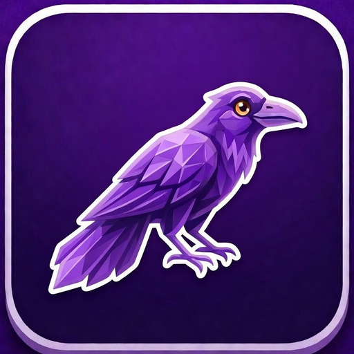
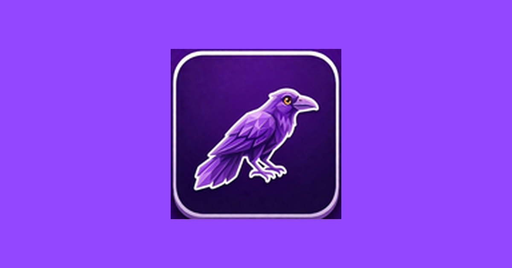

  
  <h1>Purple Crow for Safari</h1>
  
<strong>BTTV, FFZ, 7TV & 50+ features for Twitch on Safari</strong>

  

    
  

  

    
    
    
    
    
  

  

    <a href="https://corvusdevs.github.io/Purple-Crow-For-Safari/">Website</a>
  

---

Purple Crow brings BetterTTV, FrankerFaceZ, and 7TV emotes to Safari — along with 50+ quality-of-life features to make Twitch better. Auto-claim channel points, split chat, Picture-in-Picture, anonymous viewing, and much more.

  

## Features

### Emotes
- **Full BTTV, FFZ & 7TV Support** — All third-party emotes rendered natively with real-time updates
- **Emote Menu & Tab-Completion** — Browse and search emotes with a picker, or type and tab to complete
- **Animated Emote Toggle** — Enable or disable animated emotes with one click

### Chat Enhancement
- **Split Chat** — Alternating background colors with 11 themes for easier chat reading
- **Timestamps & Spoiler Tags** — See when messages were sent, hide spoilers until clicked
- **First-Time Chatter Highlights** — Spot new chatters instantly
- **Deleted Message Display** — See deleted messages shown with strikethrough
- **Mention Highlights & Keyword Filters** — Never miss when you're mentioned, filter out noise
- **Spam Filter** — Reduce chat clutter automatically
- **Chat Search** — Search through chat history to find messages

### Automation
- **Auto-Claim Everything** — Automatically collect channel points, Drops, Moments, and watch streaks
- **Auto Theater Mode** — Enter theater mode automatically when you open a stream

### Player
- **Picture-in-Picture** — One-click PiP button in the player
- **Force Video Quality** — Lock any quality from 160p to Source, persists across channels
- **OLED Mode** — Pure-black background for OLED displays with transparent chat overlay

### Privacy & More
- **Anonymous Viewing** — Watch streams without appearing in the viewer list
- **Custom Nicknames** — Set custom display names for any user
- **User Pronouns** — See user pronouns displayed in chat
- **Enhanced User Cards** — More info at a glance when clicking usernames

## Privacy

Purple Crow collects zero data — no analytics, no telemetry, no accounts. All settings are stored locally on your device. The only network requests are to emote provider APIs (BTTV, FFZ, 7TV) for loading emotes.

## More from CorvusDevs

| | App | Description |
|---|-----|-------------|
|  | [Corvus RSS Reader](https://corvusdevs.github.io/Corvus-RSS-Reader-For-Safari/) | Privacy-first RSS reader for Safari |
|  | [Auto Mute Tab for Safari](https://corvusdevs.github.io/Auto-Mute-Tab-For-Safari/) | Automatically mute background tabs in Safari |
|  | [Ekual](https://corvusdevs.github.io/Ekual/) | Automatic loudness equalization for macOS |
|  | [Tekla](https://corvusdevs.github.io/Tekla/) | Swipe-to-type virtual keyboard for macOS |

---

  Made with care by <a href="https://corvusdevs.github.io">CorvusDevs</a>

